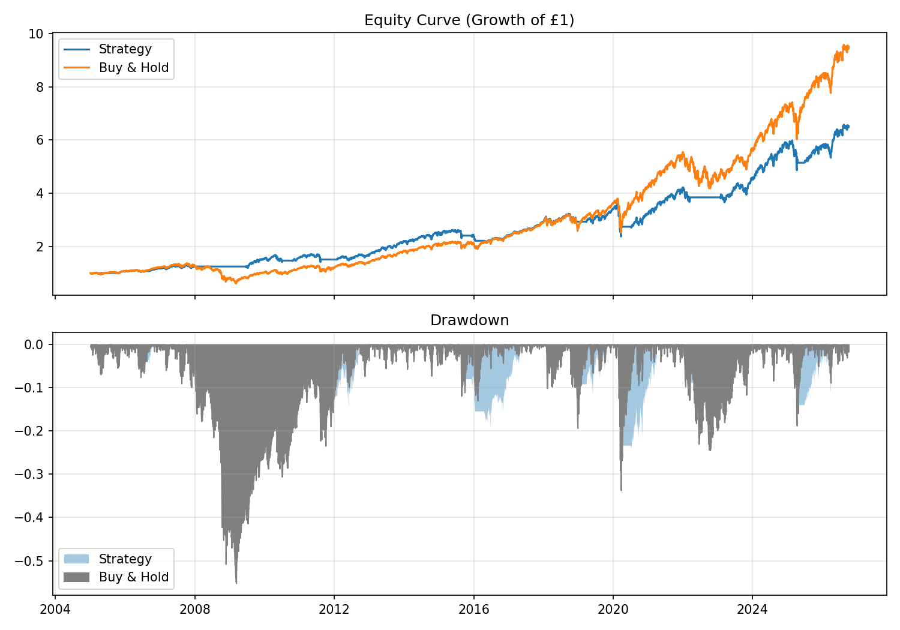
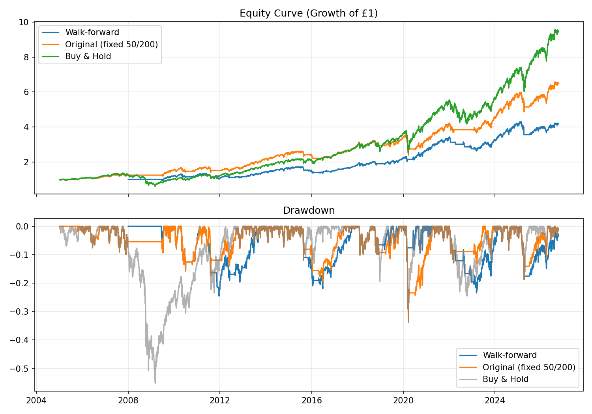

# Rolling Backtest: Moving Average Crossover Strategy

A Python backtesting framework that evaluates a moving-average crossover strategy on SPY, with risk-adjusted performance metrics: Sharpe ratio, annualised volatility, and maximum drawdown.

## What it does

- Loads price data via `yfinance`
- Generates a long/cash signal from a 50-day vs 200-day moving average crossover
- Lags signal behind to avoid lookahead bias (signal is only acted on the day *after* it is generated)
- Applies transaction costs (5 bps per trade) to model trading friction in real life
- Computes CAGR, annualised volatility, Sharpe ratio and max drawdown, when compared against a buy-and-hold benchmark
- Plots equity curve and an underwater (drawdown) chart

## Results (SPY, 2005–present)

| Metric        | Strategy | Buy & Hold |
|---------------|---------:|-----------:|
| CAGR          |    9.02% |     10.93% |
| Volatility    |   13.56% |     18.88% |
| Sharpe Ratio  |     0.71 |       0.64 |
| Max Drawdown  |  -33.72% |    -55.19% |



## Walk-forward validation

To check the original parameters (50/200-day) weren't simply a lucky fit to this specific history, the strategy was re-tested using walk-forward validation: for each year, the best-Sharpe parameter combination is selected using only the preceding 3 years of data, then traded forward on the next 12 months, which the selection process never saw. The window then rolls forward and repeats.

| Metric        | Walk-forward (OOS) | Original (fixed 50/200) | Buy & Hold |
|---------------|--------------------:|-------------------------:|-----------:|
| CAGR          |                7.94% |                     9.02% |     10.93% |
| Volatility    |               12.12% |                    13.56% |     18.88% |
| Sharpe Ratio  |                 0.69 |                      0.71 |       0.64 |
| Max Drawdown  |              -24.54% |                   -33.72% |    -55.19% |



The walk-forward Sharpe ratio (0.69) is close to the original backtest's (0.71), suggesting the original 50/200 choice was not a lucky overfit to this particular history. The optimal parameters were not stable over time (ranging from fast 10-day/slow 100-day during the volatile 2020–2022 period to slower 50-day/200-day pairs in calmer years), and this adaptivity shows up directly in the drawdown chart: the walk-forward strategy's drawdowns are visibly shallower than the fixed-parameter strategy's during 2022, at the cost of giving up some return during the recovery.

## Key finding

The strategy underperforms buy-and-hold on raw return, but it takes on less risk: around 28% lower annualised volatility and a 40% shallower maximum drawdown. It achieves a **higher Sharpe ratio** (0.71 vs 0.64), this means it delivers more return per unit of risk taken. This highlights why raw return alone is an incomplete way to judge a trading strategy.

## Methodology notes

- **Lookahead bias**: an earlier version of this project multiplied the signal by the same day's return, which silently uses future information (you can't know today's closing price until the market has closed). Lagging the signal by one day closes this gap and is the single most important correction in the project.
- **Transaction costs**: a flat 5 bps cost is applied every time the position changes, to avoid overstating returns for strategies that trade frequently.
- **Limitations**: this is a long-only, single-asset strategy tested with fixed parameters (50/200-day windows) chosen in advance rather than optimised. It does not account for bid-ask spread beyond the flat cost assumption, nor for capital constraints or taxes.

## Project structure

```
├── main.py # entry point, ties everything together
├── load_prices.py # downloads and cleans price data
├── ma_signal.py # moving average crossover signal
├── strategy_returns.py # applies signal lag + transaction costs
├── metrics.py # Sharpe, volatility, CAGR, drawdown
├── plots.py # equity curve + drawdown chart
└── requirements.txt
```


## Running it

```bash
python3 -m venv .venv
source .venv/bin/activate
pip install -r requirements.txt
python main.py
```

## Possible extensions

- Rolling Sharpe/volatility to see how risk-adjusted performance changes over time rather than as one static 20-year number
- Testing a grid of fast/slow MA combinations for parameter sensitivity